# 🚀 Quick Start Guide - Rocky Linux 9 with Entra ID

## 5 Dakikada Başlayın!

Bu rehber, sizi en hızlı şekilde çalışan bir Rocky Linux VM'e ulaştıracaktır.

---

## 📋 Deployment Process

Tüm deployment süreci görsel olarak:

```mermaid
flowchart TD
    Start["🚀 Start Deployment"]
    Click["👆 Click Deploy to Azure Button"]
    Portal["🌐 Azure Portal Opens"]
    
    subgraph Input["📝 Input Parameters"]
        RG["Resource Group Name"]
        Region["Azure Region"]
        VMName["VM Name"]
        VMSize["VM Size"]
        Auth["Authentication Type<br/>(SSH Key / Password)"]
        Monitor["Enable Monitoring?"]
    end
    
    subgraph Validation["✅ Validation Phase"]
        ValidateTemplate["Validate ARM Template"]
        CheckQuota["Check Azure Quotas"]
        ValidateParams["Validate Parameters"]
    end
    
    subgraph Resources["🏗️ Create Resources"]
        CreateRG["Create Resource Group"]
        CreateVNet["Create Virtual Network"]
        CreateNSG["Create Network Security Group"]
        CreatePIP["Create Public IP (Static)"]
        CreateNIC["Create Network Interface"]
        CreateDisk["Create OS Disk (Premium SSD)"]
        CreateVM["Create VM<br/>Rocky Linux 9.6"]
        
        CreateRG --> CreateVNet
        CreateVNet --> CreateNSG
        CreateNSG --> CreatePIP
        CreatePIP --> CreateNIC
        CreateNIC --> CreateDisk
        CreateDisk --> CreateVM
    end
    
    subgraph Extensions["🔌 Install Extensions"]
        InstallAAD["Install AADSSHLoginForLinux<br/>v1.0"]
        ConfigureAAD["Configure Entra ID Integration"]
        InstallAMA["Install AzureMonitorLinuxAgent<br/>v1.25"]
        ConfigureAMA["Configure Monitoring"]
    end
    
    subgraph Monitoring["📊 Setup Monitoring"]
        CreateLAW["Create Log Analytics Workspace"]
        CreateDCR["Create Data Collection Rule"]
        AssociateDCR["Associate DCR with VM"]
    end
    
    subgraph RBAC["🔐 RBAC Configuration"]
        AssignRole["Assign RBAC Role<br/>VM Administrator Login<br/>or VM User Login"]
        EnableMI["Enable System-Assigned<br/>Managed Identity"]
    end
    
    Complete["✅ Deployment Complete"]
    Output["📤 Outputs:<br/>- VM Name<br/>- Public IP<br/>- Resource Group<br/>- SSH Command"]
    
    Test["🧪 Test Connection"]
    Success["🎉 Ready to Use!"]
    
    Start --> Click
    Click --> Portal
    Portal --> Input
    Input --> Validation
    
    Validation -->|"Valid"| Resources
    Validation -->|"Invalid"| Portal
    
    CreateVM --> Extensions
    
    Extensions --> InstallAAD
    InstallAAD --> ConfigureAAD
    ConfigureAAD --> InstallAMA
    InstallAMA --> ConfigureAMA
    
    ConfigureAMA -->|"If enabled"| Monitoring
    ConfigureAMA -->|"If disabled"| RBAC
    
    Monitoring --> CreateLAW
    CreateLAW --> CreateDCR
    CreateDCR --> AssociateDCR
    AssociateDCR --> RBAC
    
    RBAC --> EnableMI
    EnableMI --> AssignRole
    AssignRole --> Complete
    
    Complete --> Output
    Output --> Test
    Test -->|"az ssh vm"| Success
    
    style Start fill:#4caf50,stroke:#2e7d32,color:#fff,stroke-width:3px
    style Success fill:#4caf50,stroke:#2e7d32,color:#fff,stroke-width:3px
    style Complete fill:#2196f3,stroke:#1565c0,color:#fff,stroke-width:2px
    style Validation fill:#ff9800,stroke:#e65100,stroke-width:2px
    style Resources fill:#e1f5ff,stroke:#01579b,stroke-width:2px
    style Extensions fill:#e8f5e9,stroke:#1b5e20,stroke-width:2px
    style Monitoring fill:#f3e5f5,stroke:#4a148c,stroke-width:2px
    style RBAC fill:#fff3e0,stroke:#e65100,stroke-width:2px
```



---

## 🎯 Step 1: Deploy (2 dakika)

### Option A: Deploy to Azure Button (EN KOLAY)

1. **README.md**'deki mavi butona tıklayın
2. Azure Portal açılacak
3. Aşağıdaki parametreleri doldurun:

| Parametre | Önerilen Değer | Açıklama |
|-----------|----------------|----------|
| **Subscription** | Aktif aboneliğiniz | Azure subscription seçin |
| **Resource Group** | `RockyLinuxEntraID` | Yeni oluştur |
| **Region** | `Germany West Central` | Size yakın bölge |
| **VM Name** | `my-rocky-vm` | Kısa ve açıklayıcı |
| **Admin Username** | `azureuser` | Local admin kullanıcı |
| **Authentication Type** | `sshPublicKey` | Önerilen |
| **Admin Password Or Key** | SSH public key'iniz | `cat ~/.ssh/id_rsa.pub` |
| **VM Size** | `Standard_B2s` | 2 vCPU, 4GB RAM |
| **Enable Monitoring** | `true` | ✅ Önerilen |

4. **Review + Create** → **Create** tıklayın
5. ☕ 5-10 dakika bekleyin

### Option B: Azure CLI (Gelişmiş)

```bash
# 1. Değişkenleri ayarla
RG="RockyLinuxEntraID"
LOCATION="germanywestcentral"
VM_NAME="my-rocky-vm"

# 2. Resource group oluştur
az group create --name $RG --location $LOCATION

# 3. Deploy et
az deployment group create \
  --resource-group $RG \
  --template-uri https://raw.githubusercontent.com/gokhansalihyenigun/rocky-linux-entra-id/master/azuredeploy.json \
  --parameters \
    vmName=$VM_NAME \
    adminUsername=azureuser \
    authenticationType=sshPublicKey \
    adminPasswordOrKey="$(cat ~/.ssh/id_rsa.pub)" \
    vmSize=Standard_B2s \
    enableMonitoring=true

# 4. Deployment'i takip et
az deployment group show \
  --resource-group $RG \
  --name azuredeploy \
  --query "properties.provisioningState"
```

---

## 🔐 Step 2: RBAC Rol Ataması (1 dakika)

**ZORUNLU ADIM** - Entra ID ile SSH yapabilmek için:

### Azure Portal:

1. Azure Portal → **Virtual Machines** → **my-rocky-vm**
2. Sol menüden **Access control (IAM)**
3. **+ Add** → **Add role assignment**
4. **Role** sekmesinde:
   - `Virtual Machine Administrator Login` (sudo istiyorsanız)
   - veya `Virtual Machine User Login` (normal kullanıcı)
5. **Members** sekmesinde kendinizi seçin
6. **Review + assign**

### Azure CLI (Daha Hızlı):

```bash
# Kendi kullanıcınız için (Administrator - sudo var)
az role assignment create \
  --role "Virtual Machine Administrator Login" \
  --assignee $(az account show --query user.name -o tsv) \
  --scope $(az vm show -g RockyLinuxEntraID -n my-rocky-vm --query id -o tsv)

# Başka kullanıcı için (User - sudo yok)
az role assignment create \
  --role "Virtual Machine User Login" \
  --assignee "user@company.com" \
  --scope $(az vm show -g RockyLinuxEntraID -n my-rocky-vm --query id -o tsv)
```

**Kontrol:**
```bash
az role assignment list \
  --scope $(az vm show -g RockyLinuxEntraID -n my-rocky-vm --query id -o tsv) \
  --assignee $(az account show --query user.name -o tsv) \
  -o table
```

---

## 🚀 Step 3: İlk Bağlantı (30 saniye)

### Entra ID ile SSH (ÖNERİLEN):

```bash
# En basit yöntem
az ssh vm -n my-rocky-vm -g RockyLinuxEntraID

# Başarılı olursa göreceğiniz:
# [user@domain.com@my-rocky-vm ~]$
```

**Alternatif:**
```bash
# Username belirterek
az ssh vm \
  -n my-rocky-vm \
  -g RockyLinuxEntraID \
  --local-user $(az account show --query user.name -o tsv)
```

### Geleneksel SSH (Backup):

```bash
# Public IP'yi al
VM_IP=$(az vm show -d -g RockyLinuxEntraID -n my-rocky-vm --query publicIps -o tsv)

# SSH bağlan
ssh azureuser@$VM_IP
```

---

## ✅ Step 4: Test & Doğrulama

VM'e bağlandıktan sonra:

### 1. Kimlik Kontrolü
```bash
# Entra ID kullanıcısı mısınız?
whoami
# Beklenen: user@domain.com (Entra ID ile)
# veya: azureuser (Normal SSH ile)
```

### 2. Sudo Yetkisi Kontrolü
```bash
# Administrator Login role sahipseniz çalışır
sudo whoami
# Beklenen: root
```

### 3. Sistem Bilgisi
```bash
# Rocky Linux versiyonu
cat /etc/rocky-release
# Çıktı: Rocky Linux release 9.6 (Blue Onyx)

# Sistem detayları
hostnamectl
uname -a
```

### 4. Extension Kontrolü
```bash
# AAD Extension
sudo systemctl status aad-login

# Azure Monitor Agent
sudo systemctl status azuremonitoragent
```

### 5. Monitoring Test (Azure Portal)

1. Azure Portal → **my-rocky-vm** → **Logs**
2. Bu KQL query'yi çalıştırın:
```kusto
Syslog
| where TimeGenerated > ago(1h)
| where Computer contains "my-rocky-vm"
| where SyslogMessage contains "session opened"
| project TimeGenerated, SyslogMessage
| order by TimeGenerated desc
| take 10
```

**Başarılı ise:** SSH login'lerinizi göreceksiniz! 🎉

---

## 🎯 Ne Elde Ettiniz?

✅ Rocky Linux 9.6 VM çalışıyor  
✅ Entra ID authentication aktif  
✅ RBAC ile erişim kontrolü  
✅ Azure Monitor ile full monitoring  
✅ 30 günlük log retention  
✅ SSH, sudo tüm aktiviteler loglanıyor  
✅ CPU, memory, disk metrics toplanıyor  
✅ Production-ready güvenlik konfigürasyonu  

---

## 📚 Sonraki Adımlar

### Monitoring & Alerting
- 📖 [MONITORING-GUIDE.md](./MONITORING-GUIDE.md) - KQL query'leri öğrenin
- 📊 Dashboard oluşturun
- 🚨 Alert kuralları ekleyin

### Güvenlik
- 🔒 NSG kurallarını sıkılaştırın
- 🌍 Conditional Access politikaları ekleyin
- 🔑 MFA zorunlu hale getirin

### Operasyon
- 🔄 VM'i başka kullanıcılara açın
- 📦 Uygulama deploy edin
- 🔧 Custom script'ler çalıştırın

### Troubleshooting
- 🛠️ [TROUBLESHOOTING.md](./TROUBLESHOOTING.md) - Sorun giderme rehberi

---

## 💰 Maliyet Kontrolü

Bu kurulum yaklaşık **€25-30/ay** tutacaktır:
- VM (Standard_B2s): ~€20/ay
- Premium SSD (30GB): ~€4/ay
- Public IP: ~€3/ay
- Log Analytics: ~€2/ay (10GB/ay)

**Tasarruf için:**
```bash
# VM'i deallocate et (kullanmadığında)
az vm deallocate -g RockyLinuxEntraID -n my-rocky-vm

# VM'i tekrar başlat
az vm start -g RockyLinuxEntraID -n my-rocky-vm
```

---

## 🆘 Yardım Lazım?

### Hızlı Kontroller:

1. **Extension durumu:**
```bash
az vm extension list \
  --resource-group RockyLinuxEntraID \
  --vm-name my-rocky-vm \
  --query "[].{Name:name, State:provisioningState}" -o table
```

2. **RBAC atama kontrolü:**
```bash
az role assignment list \
  --scope $(az vm show -g RockyLinuxEntraID -n my-rocky-vm --query id -o tsv) \
  -o table
```

3. **VM durumu:**
```bash
az vm get-instance-view \
  --resource-group RockyLinuxEntraID \
  --name my-rocky-vm \
  --query "instanceView.statuses[?starts_with(code, 'PowerState/')].displayStatus" -o tsv
```

### Kaynaklar:

- 📖 [Ana README](./README.md) - Detaylı dokümantasyon
- 🔧 [TROUBLESHOOTING.md](./TROUBLESHOOTING.md) - Sorun giderme
- 📊 [MONITORING-GUIDE.md](./MONITORING-GUIDE.md) - Monitoring rehberi
- 💬 [GitHub Issues](https://github.com/gokhansalihyenigun/rocky-linux-entra-id/issues) - Soru sorun

---

<div align="center">

**Tebrikler! 🎉**

Rocky Linux 9 VM'iniz Entra ID authentication ve Azure Monitor ile çalışıyor!

**[⬆ Ana Sayfaya Dön](./README.md)**

</div>